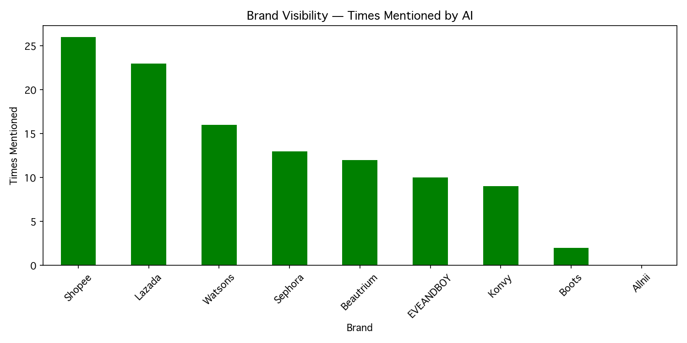
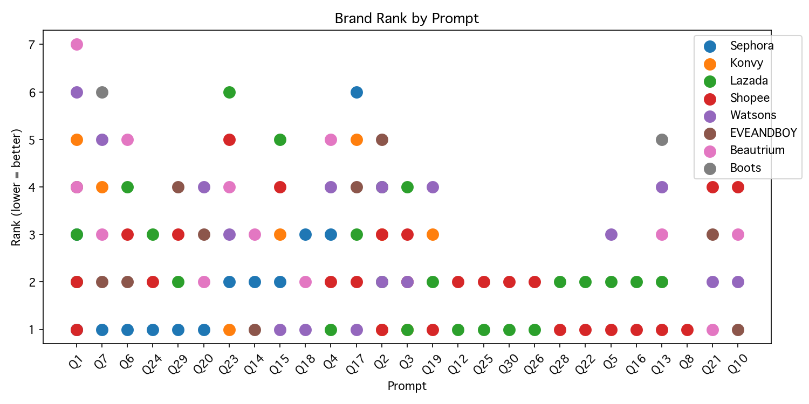
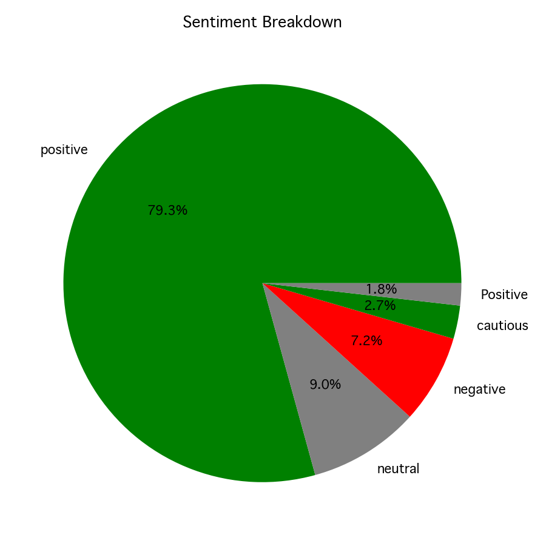
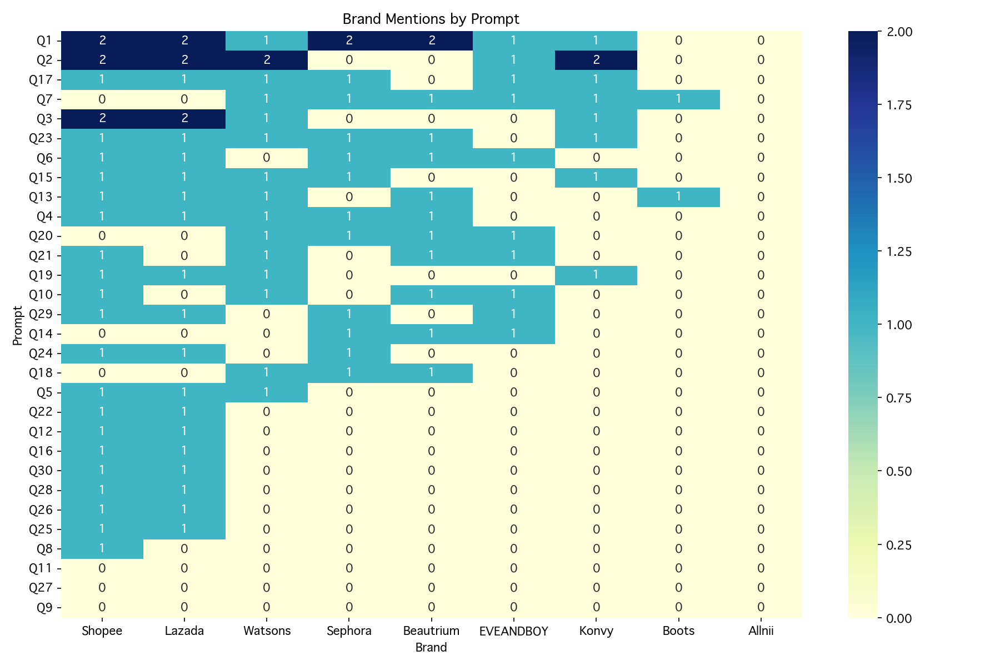
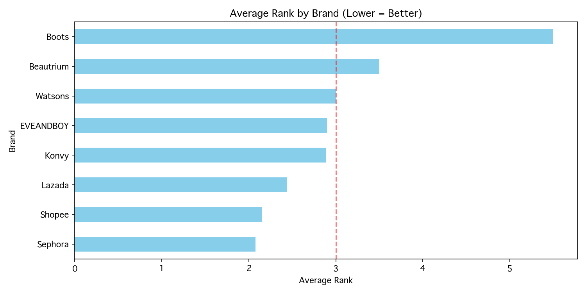
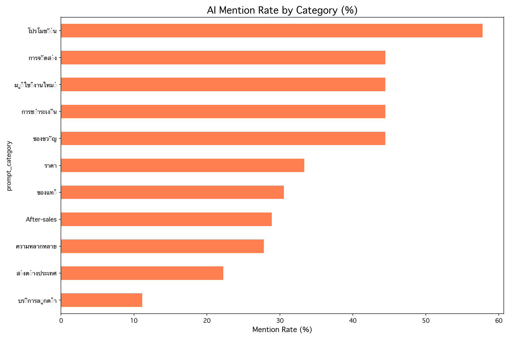

# AI Brand Visibility Tracker

**Measuring brand presence in the age of AI-powered recommendations**

[](https://python.org)
[](https://ai.google.dev)
[](LICENSE)

---

## Overview

Traditional SEO optimizes for search engines. But when users ask Claude, ChatGPT, or Gemini *"Where should I shop for cosmetics in Thailand?"* — which brands appear in the response?

This project quantifies **brand visibility in AI-generated recommendations** through systematic prompt testing and response analysis. It tracks mention frequency, ranking position, sentiment, and reasoning across multiple query types.

**Use case:** Marketing teams can identify visibility gaps, understand competitive positioning in AI responses, and optimize content strategy for generative engine optimization (GEO).

---

## Key Findings

From analyzing **270 AI responses** (9 brands × 30 prompts):

**Market Leaders**
- Shopee and Lazada dominate with 78.8% and 69.7% mention rates
- Both maintain strong positions (avg rank ~2.0) across query types

**Specialty Players**
- Sephora: 39.4% mention rate, strongest in gift and authenticity queries (avg rank 2.08)
- EVEANDBOY, Konvy: Moderate visibility (27-30%), category-specific strength

**Visibility Gap**
- Allnii: 0% mention rate across all prompts — complete AI invisibility
- Indicates insufficient structured content for AI model training/retrieval

**Category Insights**
- Highest AI confidence: product authenticity, first-time buyer, provincial shipping (66.7% mention rate)
- AI avoidance: counterfeit concerns, customer service, new brand discovery (0% mention rate)

---

## Methodology

### Data Collection
```
30 prompts × 9 brands × 2 API calls = 540 requests
├─ Primary call: Brand mention detection
└─ Secondary call: Sentiment analysis
```

### Metrics Tracked

| Metric | Description | Use Case |
|--------|-------------|----------|
| **Visibility** | Binary mention (True/False) | Market share of voice |
| **Position** | Character index in response | Prominence measurement |
| **Rank** | Sequential order (1st, 2nd, 3rd...) | Competitive positioning |
| **Sentiment** | Positive/Neutral/Negative | Brand perception |
| **Reasoning** | AI's stated rationale | Messaging effectiveness |

### Query Categories

Prompts span the customer journey:
- **Discovery:** Price comparison, product variety, authenticity
- **Purchase:** Shipping, payment methods, first-time buyer concerns  
- **Post-purchase:** Returns, customer service, issue resolution
- **Specialty:** Gift wrapping, international shipping

---

## Analysis Results

### Brand Visibility


### Competitive Positioning


### Sentiment Distribution


### Category × Brand Performance


### Average Ranking


### Query Type Performance


*Full analysis available in [analysis.ipynb](analysis.ipynb)*

---

## Technical Implementation

### Architecture
```
collector.py → Gemini API → SQLite → analysis.ipynb → Insights
```

### Configuration
Edit `config.py` to customize tracking parameters:

```python
MODEL_NAME = "gemini-2.5-flash"

BRANDS = [
    "YourBrand",
    "Competitor1", 
    "Competitor2",
]

PROMPTS = [
    "Where should I buy cosmetics online in Thailand?",
    "Which platform has the best beauty product selection?",
    # Add customer queries
]
```

### Data Schema

| Column | Type | Description |
|--------|------|-------------|
| `timestamp` | datetime | Collection time |
| `model` | string | AI model identifier |
| `prompt` | string | User query |
| `brand` | string | Tracked brand name |
| `mentioned` | boolean | Mention status |
| `position` | integer | Character index (-1 if not found) |
| `rank` | integer | Mention order (0 if not mentioned) |
| `sentiment` | string | positive / neutral / negative / not_mentioned |
| `reason` | string | AI's explanation |
| `prompt_category` | string | Query classification |

---

## Technology Stack

**Language:** Python 3.11+  
**API:** Google Gemini 2.5 Flash  
**Storage:** SQLite  
**Analysis:** pandas, NumPy  
**Visualization:** Matplotlib, Seaborn  
**Environment:** python-dotenv

---

## Business Applications

**For Marketing Teams:**
- Identify which competitors AI favors in recommendations
- Discover query types where your brand is invisible
- Understand sentiment patterns across different contexts
- Prioritize content creation based on AI visibility gaps

**For Product Managers:**
- Validate market positioning in AI-native channels
- Track brand perception shifts over time
- Benchmark against competitors in emerging search paradigm

**For Content Strategists:**
- Optimize structured data and metadata for AI retrieval
- Create content addressing AI-identified brand weaknesses
- Target high-impact query categories with low current visibility

---

## Project Structure

```
ai-brand-tracker/
├── collector.py           # Data collection pipeline
├── config.py              # Configuration parameters
├── analysis.ipynb         # Statistical analysis & visualization
├── results.db             # SQLite database
├── requirements.txt       # Python dependencies
├── .env                   # API credentials (not tracked)
└── images/                # Generated visualizations
```

---

## Error Handling

**Rate Limiting:** 30-second exponential backoff with automatic retry  
**API Timeouts:** Graceful degradation, continues to next prompt  
**Sentiment Failures:** Logs error, marks as `not_mentioned`, proceeds  

---

## Learnings

**Technical Skills:**
- API integration with retry logic and error handling
- Structured data collection pipeline design
- SQLite database schema optimization
- Statistical analysis of categorical and ordinal data
- Data visualization for business stakeholders

**Domain Knowledge:**
- Generative engine optimization (GEO) principles
- AI model behavior patterns in recommendation tasks
- Brand positioning metrics for AI-native channels

**Business Impact:**
- Identified 0% visibility for target brand (Allnii)
- Quantified competitive gaps (Shopee 78.8% vs Allnii 0%)
- Pinpointed high-value categories for content investment

---

## Future Development

- [ ] Multi-model comparison (Claude, GPT-4, Llama)
- [ ] Temporal tracking (weekly/monthly visibility trends)
- [ ] Source citation analysis (where AI gets brand information)
- [ ] Automated report generation
- [ ] CLI interface for ad-hoc queries

---

## Sample Output

```csv
timestamp,model,prompt,brand,mentioned,position,rank,sentiment,reason
2026-03-24 13:42,gemini-2.5-flash,ซื้อเครื่องสำอางที่ไหนดี?,Shopee,True,232,1,positive,มีสินค้าหลากหลายและโปรโมชั่นบ่อย
2026-03-24 13:42,gemini-2.5-flash,ซื้อเครื่องสำอางที่ไหนดี?,Lazada,True,640,2,positive,มี LazMall สำหรับสินค้าแท้และระบบส่งดี
2026-03-24 13:42,gemini-2.5-flash,ซื้อเครื่องสำอางที่ไหนดี?,Allnii,False,-1,0,not_mentioned,ไม่ถูกพูดถึง
```

*Full sample dataset available in [sample_output/](sample_output/)*

---

## License

MIT License — Free for personal and commercial use

---

**Built with Python** | Data-driven insights for the AI era