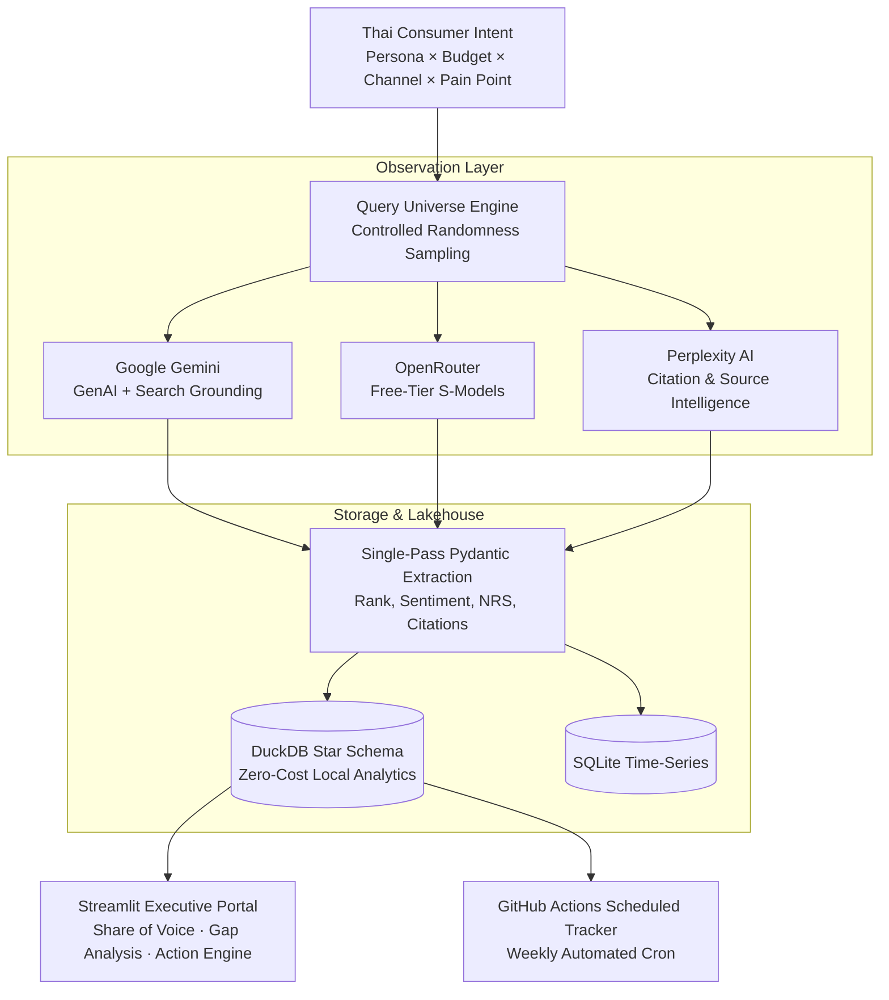

# 🇹🇭 Thailand AI Market & Decision Intelligence Platform
[](https://www.python.org/)
[]()
[](https://opensource.org/licenses/MIT)

An enterprise-grade **Generative Engine Optimization (GEO)**, **AI Share of Voice**, and **Thai Consumer Decision Intelligence Platform**.

---

## 🎯 The Core Question
> *What are Thai consumers asking and discovering across AI and search ecosystems? What do AI answer engines recommend to them, why do certain platforms win, and what strategic actions should businesses take next?*


```mermaid
graph TD
    UserQuery[Thai Consumer Intent
Persona × Budget × Channel × Pain Point] --> Generator[Query Universe Engine
Controlled Randomness Sampling]
    
    subgraph Observation Layer
        Generator --> Engine1[Google Gemini
GenAI + Search Grounding]
        Generator --> Engine2[OpenRouter
Free-Tier S-Models]
        Generator --> Engine3[Perplexity AI
Citation & Source Intelligence]
    end
    
    Engine1 & Engine2 & Engine3 --> Pydantic[Single-Pass Pydantic Extraction
Rank, Sentiment, NRS, Citations]
    
    subgraph Storage & Lakehouse
        Pydantic --> DuckDB[(DuckDB Star Schema
Zero-Cost Local Analytics)]
        Pydantic --> SQLite[(SQLite Time-Series)]
    end
    
    DuckDB --> Dashboard[Streamlit Executive Portal
Share of Voice · Gap Analysis · Action Engine]
    DuckDB --> Cron[GitHub Actions Scheduled Tracker
Weekly Automated Cron]
```

---

## 🚀 Quickstart (Local Offline Simulation)

```bash
# 1. Clone and switch to upgrade branch
git clone https://github.com/adulsaa-q/ai_brand_tracker.git
cd ai_brand_tracker
git checkout upgrade/thailand-intelligence-v3

# 2. Run simulation pipeline (0 API keys needed)
python src/cli.py run --count 15 --engine mock

# 3. Launch Interactive Dashboard
streamlit run dashboard/app.py
```

---

## 📁 Repository Structure
* `config/`: Multi-vertical entities & Thai consumer personas
* `src/universe/`: Query Universe Generator with controlled randomness
* `src/engines/`: Multi-Model Observation Layer (Gemini, OpenRouter, Mock)
* `src/storage/`: DuckDB Lakehouse + Zero-dependency SQLite Store
* `src/analytics/`: Share of Voice, Net Recommendation Score (NRS), Opportunity Finder
* `dashboard/`: Interactive Streamlit multi-tab executive portal
* `docs/`: Master Prompt & Thai consumer behavior research 2026

---

## 📄 License
MIT License — Copyright (c) 2026 Adul Saa (Q).
