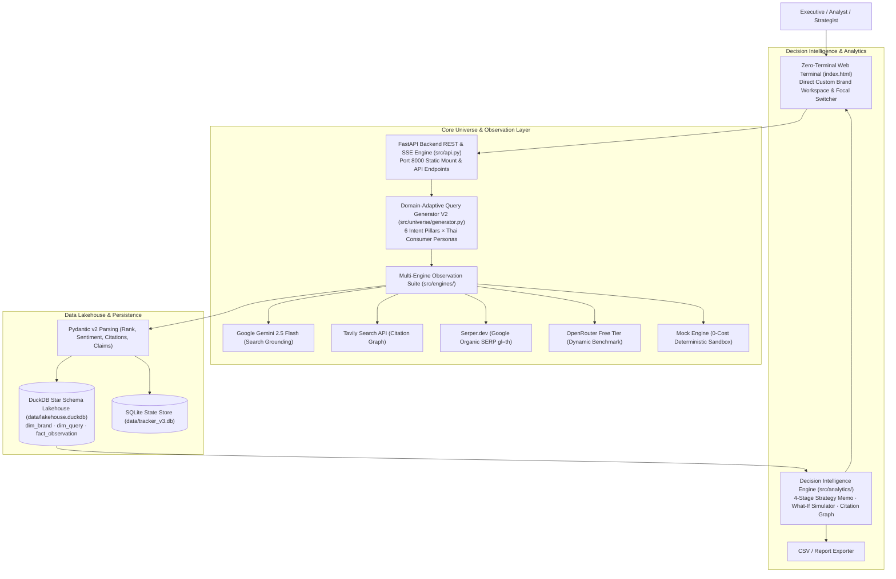

# Thailand AI Market & Decision Intelligence Platform

[](https://www.python.org/)
[](https://fastapi.tiangolo.com/)
[](https://duckdb.org/)
[](https://github.com/astral-sh/ruff)
[](https://docs.pytest.org/)
[](https://opensource.org/licenses/MIT)

A production-grade **Generative Engine Optimization (GEO)**, **AI Share of Voice (SoV)**, **Multi-Model Search Grounding**, and **Consumer Decision Intelligence Platform** engineered for continuous market surveillance, competitive gap analysis, and automated executive decision memos across Thailand's digital commerce ecosystems.

---

## 1. System Architecture


```mermaid
graph TD
    User["Executive / Analyst / Strategist"] --> UI["Zero-Terminal Web Terminal (index.html)<br/>Direct Custom Brand Workspace & Focal Switcher"]
    UI --> API["FastAPI Backend REST & SSE Engine (src/api.py)<br/>Port 8000 Static Mount & API Endpoints"]
    
    subgraph Core Universe & Observation Layer
        API --> Gen["Domain-Adaptive Query Generator V2 (src/universe/generator.py)<br/>6 Intent Pillars × Thai Consumer Personas"]
        Gen --> Engines["Multi-Engine Observation Suite (src/engines/)"]
        Engines --> E1["Google Gemini 2.5 Flash (Search Grounding)"]
        Engines --> E2["Tavily Search API (Citation Graph)"]
        Engines --> E3["Serper.dev (Google Organic SERP gl=th)"]
        Engines --> E4["OpenRouter Free Tier (Dynamic Benchmark)"]
        Engines --> E5["Mock Engine (0-Cost Deterministic Sandbox)"]
    end
    
    subgraph Data Lakehouse & Persistence
        Engines --> Pydantic["Pydantic v2 Parsing (Rank, Sentiment, Citations, Claims)"]
        Pydantic --> DuckDB[("DuckDB Star Schema Lakehouse (data/lakehouse.duckdb)<br/>dim_brand · dim_query · fact_observation")]
        Pydantic --> SQLite[("SQLite State Store (data/tracker_v3.db)")]
    end
    
    subgraph Decision Intelligence & Analytics
        DuckDB --> Analytics["Decision Intelligence Engine (src/analytics/)<br/>4-Stage Strategy Memo · What-If Simulator · Citation Graph"]
        Analytics --> UI
        Analytics --> CSV["CSV / Report Exporter"]
    end
```

---

## 2. Core Capabilities & Highlights

* **Universal Multi-Vertical Support**:
  - Pre-configured with 6 benchmark sectors:
    1. `ecommerce_retail_th` (E-Commerce & Beauty Retail)
    2. `ev_automotive_th` (Electric Vehicles & Automotive)
    3. `banking_fintech_th` (Banking, Digital Loans & FinTech)
    4. `real_estate_th` (Real Estate & Condominiums)
    5. `hospital_healthcare_th` (Private Hospitals & Healthcare)
    6. `fnb_coffee_th` (Food, Beverage & Coffee Retail Chains)
* **Custom Brand Workspace (Zero-Terminal Direct Input)**:
  - Users can directly type their own brand, competitor entities, and market category right on the UI to receive instant real-time telemetry and customized 4-stage strategic recommendations.
* **Domain-Adaptive Query Universe Generator V2**:
  - Parameterized across **6 Consumer Intent Pillars** (*Promotion, Trust/Authenticity, Variety/Quality, Service/Speed, Payment/0%, Comparison*) with seeded reproducibility.
* **4-Stage Decision Intelligence Framework**:
  - Structures business actions into **What is happening ➔ Why ➔ So what (Impact) ➔ Now what (Action)** categorized by P1 Critical, P2 Defensive, and P3 Opportunities.
* **Full-Stack Single-Port Server**:
  - Serves both high-performance REST APIs and the rich web terminal on a single unified port (`http://127.0.0.1:8000`).

---

## 3. Quickstart & Command-Line Usage

### 3.1 Start Full-Stack Server (Web Terminal + REST API)

```bash
# Launch FastAPI backend + Web Terminal on port 8000 and auto-open browser
python src/cli.py serve --port 8000
```
Open your browser at **[http://localhost:8000](http://localhost:8000)**.

### 3.2 Run Autonomous AI Intelligence Scan via CLI

```bash
# Run scan across any vertical with 30 invariant benchmark queries
python src/cli.py run --vertical ev_automotive_th --count 30 --engine mock

# Run real-world Google Gemini 2.5 Flash Grounded Scan
python src/cli.py run --vertical ecommerce_retail_th --count 15 --engine gemini
```

### 3.3 Synthesize Domain Queries

```bash
# Generate deterministic domain-adaptive query suite
python src/cli.py generate --vertical banking_fintech_th --count 20 --seed 42
```

---

## 4. API Endpoints Reference

| Method | Endpoint | Description |
| :--- | :--- | :--- |
| `GET` | `/api/v1/health` | Service health status and system version |
| `GET` | `/api/v1/verticals` | List all available benchmark verticals and metadata |
| `POST` | `/api/v1/verticals` | Dynamically create a custom industry sector |
| `POST` | `/api/v1/scan` | Trigger background AI observation scan worker |
| `GET` | `/api/v1/scan/{task_id}/progress` | Real-time scan progress %, query counter, and log stream |
| `GET` | `/api/v1/metrics/{vertical_id}` | Aggregated DuckDB market metrics, SoV, and sentiment |
| `GET` | `/api/v1/export/{vertical_id}` | Export full observation report in CSV or JSON format |
| `GET` | `/` | Web Executive Terminal (`dashboard/web/index.html`) |

---

## 5. Automated Test Suite & Quality Verification

Run the comprehensive unit and integration test suite:

```bash
# Run Pytest suite
pytest tests/

# Check 100% Ruff lint and formatting compliance
ruff check .
ruff format --check .
```

* **Test Coverage**: 28 passed tests across API routes, query generators, multi-vertical engines, lakehouse persistence, and opportunity models.

---

## 6. Project Structure

```
ai_brand_tracker/
├── config/
│   ├── entities.yaml               # 6 core benchmark verticals & competitor registry
│   ├── control_benchmark_set.yaml  # Longitudinal invariant 30 queries
│   ├── thai_personas.yaml          # Consumer persona definitions
│   └── settings.yaml               # Engine weights and scoring parameters
├── dashboard/
│   └── web/
│       └── index.html              # Flagship Executive Web Terminal
├── data/
│   ├── lakehouse.duckdb            # Star Schema OLAP Lakehouse
│   └── tracker_v3.db               # Transactional SQLite store
├── docs/
│   ├── V5_DELTA_BLUEPRINT.md       # V5 Architectural Delta Blueprint
│   ├── UNIVERSAL_AI_PLATFORM_V4_BLUEPRINT.md
│   └── research/                   # Thai consumer & GEO research papers
├── src/
│   ├── analytics/                  # Decision intelligence, opportunity finder, simulator
│   ├── engines/                    # Multi-engine adapters (Gemini, Tavily, Serper, OpenRouter, Mock)
│   ├── models/                     # Pydantic v2 domain schemas
│   ├── storage/                    # DuckDB and SQLite storage managers
│   ├── universe/                   # Domain-adaptive Query Universe Generator V2
│   ├── api.py                      # FastAPI REST & SSE Background Server
│   ├── cli.py                      # Unified CLI entrypoint
│   └── runner.py                   # Intelligence scan execution pipeline
└── tests/                          # 28/28 Unit & integration test suites
```

---

## 7. License & Authorship

Developed by **Adul Saa (Q)** for autonomous enterprise intelligence operations. Released under the [MIT License](LICENSE).
