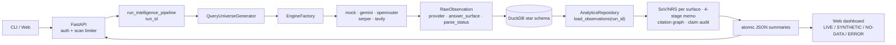

<div align="center">

  <h1 style="font-size: 2.3em; font-weight: 800; letter-spacing: 1px; margin-bottom: 6px;">THAILAND AI MARKET &amp; DECISION INTELLIGENCE</h1>
  <h3 style="font-weight: 600; margin-top: 0;">AI SHARE OF VOICE · GENERATIVE ENGINE OPTIMIZATION · CITATION AUTHORITY</h3>

  <sub>How generative AI answers recommend Thai brands · Multi-surface observation · DuckDB star schema · 4-stage decision memos</sub>

  <br/><br/>

  &nbsp;
  &nbsp;
  &nbsp;
  &nbsp;
  

</div>

---

###  &nbsp;What This Measures

When a Thai consumer asks an AI *"ซื้อ / ใช้บริการ ที่ไหนดี"*, which brand gets recommended, at what rank, with what sentiment, and which web sources drove that answer. It runs a fixed query set against several answer surfaces, stores every observation in a star schema, and builds a **What → Why → So what → Now what** memo per market vertical.

<table width="100%">
<tr>
<td width="50%" valign="top">
<br/>
 &nbsp;<b>MULTI-SURFACE, NEVER MIXED</b>
<br/><br/>

<br/><br/>
A Gemini recommendation rank and a Google SERP position are different signals. Share of Voice headline numbers use the <code>generative_answer</code> surface only; every other surface is kept in a separate breakdown, never averaged in.
<br/><br/>
</td>
<td width="50%" valign="top">
<br/>
 &nbsp;<b>ONE ANALYTICAL SOURCE OF TRUTH</b>
<br/><br/>

<br/><br/>
<code>dim_brand · dim_query · fact_observation · fact_brand_mention · fact_citation</code>. Analytics read back from DuckDB by <code>run_id</code> — not the in-memory list — so a dropped mention shows up as dropped.
<br/><br/>
</td>
</tr>
<tr>
<td width="50%" valign="top">
<br/>
 &nbsp;<b>HONEST PROVENANCE</b>
<br/><br/>

<br/><br/>
UUID ids, correct provider labels, prompt version, retry count. A malformed model response is recorded as <code>parse_error</code> — never silently turned into "brand not mentioned".
<br/><br/>
</td>
<td width="50%" valign="top">
<br/>
 &nbsp;<b>FREE TIER, BRING YOUR OWN KEY</b>
<br/><br/>

<br/><br/>
The OpenRouter free tier changes constantly, so the model list is fetched live and probe-checked. Keys travel per request (<code>X-Provider-Key</code>) and are never logged or persisted.
<br/><br/>
</td>
</tr>
</table>

---

###  &nbsp;Executive Dashboard

<div align="center">
  
  <br/>
  <sub>Every view carries an explicit data-mode banner: <b>LIVE</b> · <b>SYNTHETIC (MOCK)</b> · <b>NO DATA</b> · <b>ERROR</b>. Nothing is presented as real unless a real scan produced it.</sub>
</div>

---

###  &nbsp;Project Flow

Full diagram set (system map · scan sequence · star-schema ERD · surface taxonomy · BYOK flow) in **[docs/ARCHITECTURE.md](docs/ARCHITECTURE.md)**.


```mermaid
flowchart LR
    CLI["CLI / Web"] --> API["FastAPI<br/>auth + scan limiter"]
    API --> RUN["run_intelligence_pipeline<br/>run_id"]
    RUN --> GEN["QueryUniverseGenerator"] --> ENG["EngineFactory"]
    ENG --> E["mock · gemini · openrouter<br/>serper · tavily"]
    E --> OBS["RawObservation<br/>provider · answer_surface · parse_status"]
    OBS --> DUCK[("DuckDB star schema")]
    DUCK --> REPO["AnalyticsRepository<br/>load_observations(run_id)"]
    REPO --> AN["SoV/NRS per surface · 4-stage memo<br/>citation graph · claim audit"]
    AN --> OUT["atomic JSON summaries"]
    OUT --> API
    OUT --> WEB["Web dashboard<br/>LIVE / SYNTHETIC / NO-DATA / ERROR"]
```

---

###  &nbsp;Quickstart

```bash
pip install -e ".[dev]"                 # core + tests
pip install -e ".[dev,dashboard]"       # + Streamlit view

cp .env.example .env                    # add GEMINI / OPENROUTER / SERPER / TAVILY keys (all optional)

# deterministic, zero-cost, clearly labelled synthetic
python -m src.cli run --vertical ev_automotive_th --count 30 --engine mock

# real generative run
python -m src.cli models                                    # live OpenRouter free list
python -m src.cli run --engine openrouter --count 15 --vertical ecommerce_retail_th
python -m src.cli run --engine gemini    --count 15 --vertical ecommerce_retail_th

# full-stack server + web dashboard
python -m src.cli serve --port 8000                         # http://localhost:8000
```

<table width="100%">
<tr><td width="25%"><b>Engine</b></td><td width="20%"><b>Surface</b></td><td width="15%"><b>Speed</b></td><td><b>Notes</b></td></tr>
<tr><td><code>mock</code></td><td>synthetic</td><td>instant</td><td>deterministic (SHA-256 seed), always labelled — never a decision input</td></tr>
<tr><td><code>serper</code></td><td>organic_serp</td><td>~2s / query</td><td>Google SERP position · free 2,500 queries</td></tr>
<tr><td><code>tavily</code></td><td>web_retrieval</td><td>~5s / query</td><td>citation grounding · free 1,000 credits/mo</td></tr>
<tr><td><code>gemini</code></td><td>generative_answer</td><td>~25s / query</td><td>Google Search grounded · free tier ~250 req/day</td></tr>
<tr><td><code>openrouter</code></td><td>generative_answer</td><td>~30-60s / query</td><td>auto-picks a working free model · slow but $0</td></tr>
</table>

> Generative engines are slow — run large scans as a background job / weekly cron, or keep `--count` small.

---

###  &nbsp;API

| Method | Endpoint | |
| :--- | :--- | :--- |
| `GET` | `/api/v1/health` | liveness + dependency checks + auth mode |
| `GET` | `/api/v1/verticals` | list market sectors |
| `GET` | `/api/v1/models` | live OpenRouter free-model list |
| `POST` | `/api/v1/verticals` | create/replace a custom sector · **write** |
| `POST` | `/api/v1/scan` | queue a background scan (`X-Provider-Key` for BYOK) · **write** |
| `GET` | `/api/v1/scan/{id}/progress` | live progress + run stats |
| `GET` | `/api/v1/metrics/{vertical}` | last run summary |
| `GET` | `/api/v1/export/{vertical}` | CSV / JSON |

`AIBT_API_KEYS` unset → **open mode** (writes allowed, logged, `/health` says so). Set it to require `X-API-Key` on writes. Concurrency + daily-quota limits, CORS config, and the untrusted-content model are in **[SECURITY.md](SECURITY.md)**.

---

###  &nbsp;Stack

<table width="100%">
<tr>
<td width="25%"><b>Core</b></td>
<td>
  
  
  
  
  
</td>
</tr>
<tr>
<td><b>Observation engines</b></td>
<td>
  
  
  
  
</td>
</tr>
<tr>
<td><b>Quality</b></td>
<td>
  
  
  
  
</td>
</tr>
</table>

---

###  &nbsp;Layout

```
config/            entities.yaml · control_benchmark_set.yaml · thai_personas.yaml
src/
  runner.py        pipeline: generate → observe → persist → reload from DuckDB → analyse
  api.py           FastAPI REST + static mount        security.py   auth + scan limiter
  prompts.py       versioned prompt registry          brands.py     canonical brand identity
  ids.py           UUID run / observation ids         env auto-load (.env)
  universe/        QueryUniverseGenerator + Thai temporal calendar
  engines/         mock · gemini · openrouter · serper · tavily   (+ _http retry, _parsing)
  storage/         duckdb_store.py                    (SQLite dropped — ADR 0001)
  analytics/       metrics · opportunity · citation_graph · claim_intelligence ·
                   information_lag · simulator · repository
docs/
  ARCHITECTURE.md  6 mermaid diagrams        STATUS.md   per-feature Shipped/Experimental/Demo
  adr/             0001 single store · 0002 answer surfaces + temporal context
```

---

###  &nbsp;Tests &amp; Quality

```bash
pytest tests/ -q             # 72: unit · contract · integration · acceptance
ruff check . && ruff format --check .
python -m build --wheel      # packaging smoke
```

CI runs editable install → wheel build → import smoke → ruff → full suite on every push.
End-to-end reconciliation is asserted (generated queries = persisted observations = mention/citation grain = analytics input), and an acceptance test walks the whole scenario: auth → validate → scan → unique ids → provenance → persist → canonical analytics → export, plus *a failed engine is never reported as a successful insight*.

---

<div align="center">
  <sub>Built by <b>Adul Sa-a (Q)</b> · MIT License · see <a href="docs/STATUS.md">docs/STATUS.md</a> for the honest per-feature state</sub>
</div>
