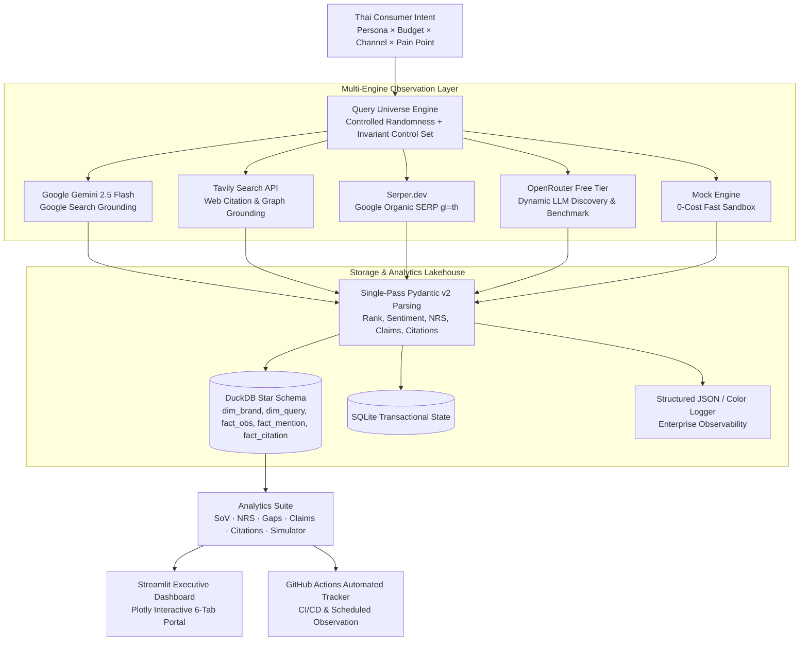

# 🇹🇭 Thailand AI Market & Decision Intelligence Platform

[](https://www.python.org/)
[]()
[](https://github.com/astral-sh/ruff)
[](https://docs.pytest.org/)
[](https://opensource.org/licenses/MIT)

An enterprise-grade **Generative Engine Optimization (GEO)**, **AI Share of Voice (SoV)**, **Search / SERP Grounding**, and **Thai Consumer Decision Intelligence Platform** designed for high-performance market surveillance and strategic action planning.

---

## 🎯 The Mission & Core Question

> *What are Thai consumers asking and discovering across AI, search, and social commerce ecosystems? What do AI answer engines recommend to them, why do certain platforms win, and what strategic actions should businesses take next?*


```mermaid
graph TD
    UserQuery[Thai Consumer Intent
Persona × Budget × Channel × Pain Point] --> Generator[Query Universe Engine
Controlled Randomness + Invariant Control Set]
    
    subgraph Multi-Engine Observation Layer
        Generator --> Engine1[Google Gemini 2.5 Flash
Google Search Grounding]
        Generator --> Engine2[Tavily Search API
Web Citation & Graph Grounding]
        Generator --> Engine3[Serper.dev
Google Organic SERP gl=th]
        Generator --> Engine4[OpenRouter Free Tier
Dynamic LLM Discovery & Benchmark]
        Generator --> Engine5[Mock Engine
0-Cost Fast Sandbox]
    end
    
    Engine1 & Engine2 & Engine3 & Engine4 & Engine5 --> Pydantic[Single-Pass Pydantic v2 Parsing
Rank, Sentiment, NRS, Claims, Citations]
    
    subgraph Storage & Analytics Lakehouse
        Pydantic --> DuckDB[(DuckDB Star Schema
dim_brand, dim_query, fact_obs, fact_mention, fact_citation)]
        Pydantic --> SQLite[(SQLite Transactional State)]
        Pydantic --> Logger[Structured JSON / Color Logger
Enterprise Observability]
    end
    
    DuckDB --> Analytics[Analytics Suite
SoV · NRS · Gaps · Claims · Citations · Simulator]
    
    Analytics --> Dashboard[Streamlit Executive Dashboard
Plotly Interactive 6-Tab Portal]
    Analytics --> Actions[GitHub Actions Automated Tracker
CI/CD & Scheduled Observation]
```

---

## 🏗️ Core Architecture & Enterprise Features (2026 Ready)

* **Multi-Engine Observation Suite**:
  - **Google Gemini 2.5 Flash**: Native Google Search Grounding with web metadata.
  - **Tavily AI Search**: High-precision Thai citation crawling across Pantip, Wongnai, Shopee, Konvy.
  - **Serper Google SERP**: Organic search rankings in Thailand (`gl=th`) for SEO vs GEO comparison.
  - **OpenRouter Free Tier**: Automatic real-time discovery of 21 free models with Thai qualification micro-benchmarking.
  - **Mock Sandbox**: Fast, offline, deterministic testing with 0 API cost.
* **Query Universe Engine**:
  - Invariant **30 Control Benchmark Set** for longitudinal tracking.
  - Dynamic **Exploratory Query Generator** with persona, intent, budget, and Thai slang injection.
* **Thailand Temporal Event Engine**:
  - Injects contextual retail hooks: Double Day (8.8, 9.9, 11.11), Payday (25-30th), Mid-Month, Songkran, Back-to-School.
* **Decision Intelligence & What-If Simulator**:
  - Formulas for **AI Share of Voice (SoV)**, **Net Recommendation Score (NRS)**, and **Citation Authority Index (CAI)**.
  - **`MarketStrategySimulator`**: Forecasts visibility gains when activating marketing levers (Pantip advocacy, Official Mall guarantees, YouTube creator unboxing).
* **Lakehouse Star Schema (DuckDB & SQLite)**:
  - `dim_brand`, `dim_query`, `fact_observation`, `fact_brand_mention`, `fact_citation`.

---

## 🚀 Quickstart & CLI Guide

### 1. Installation & Environment Setup

```bash
# Clone the repository
git clone https://github.com/adulsaa-q/ai_brand_tracker.git
cd ai_brand_tracker

# Install with dependencies
pip install -e .
```

### 2. Environment Variables (`.env`)

Copy `.env.example` to `.env` and provide your API keys:

```env
OPENROUTER_API_KEY=your_openrouter_api_key_here
GEMINI_API_KEY=your_gemini_api_key_here
TAVILY_API_KEY=your_tavily_api_key_here
SERPER_API_KEY=your_serper_api_key_here
```

### 3. CLI Commands

```bash
# 1. Migrate Historical Data (v1 legacy CSV -> v3 DuckDB & SQLite)
python src/cli.py migrate

# 2. Discover Available Free AI Models on OpenRouter
python src/cli.py models

# 3. Generate Thai Consumer Queries (Control + Exploratory)
python src/cli.py generate --count 10 --seed 42 --control

# 4. Run Full Intelligence Pipeline across any engine
python src/cli.py run --count 10 --engine gemini     # Google Gemini + Search Grounding
python src/cli.py run --count 10 --engine tavily     # Tavily Web Grounding
python src/cli.py run --count 10 --engine serper     # Google Organic SERP in TH
python src/cli.py run --count 10 --engine openrouter # Free OpenRouter LLMs
python src/cli.py run --count 20 --engine mock       # 0-Cost Offline Sandbox

# 5. Launch Executive Plotly Streamlit Dashboard
python src/cli.py dashboard
# Or directly: streamlit run dashboard/app.py
```

---

## 🧪 Testing & Code Quality

The platform enforces strict 2026 enterprise Python standards:

```bash
# Run Ruff Linter & Formatter (100% compliant)
ruff check .
ruff format .

# Run Automated Pytest Suite (18 tests passing)
pytest tests/ -v
```

---

## 📁 Repository Layout

```
ai_brand_tracker/
├── .github/workflows/
│   ├── ci.yml                     # Continuous Integration workflow
│   └── weekly_tracker.yml         # Automated weekly tracking cron
├── config/
│   ├── control_benchmark_set.yaml # 30 invariant benchmark queries
│   ├── entities.yaml              # Multi-vertical brands, domains, aliases
│   └── thai_personas.yaml         # Thai shopper demographic personas
├── dashboard/
│   └── app.py                     # 6-Tab Plotly Executive Streamlit Dashboard
├── docs/
│   ├── MASTER_BLUEPRINT_V3.md     # Architecture Blueprint & Math Formulas
│   ├── FORENSIC_AUDIT.md          # System Forensic Audit
│   └── research/                  # Thai digital consumer 2026 research
├── src/
│   ├── analytics/                 # SoV, NRS, Citations, Claims, Simulator
│   ├── engines/                   # Gemini, Tavily, Serper, OpenRouter, Mock
│   ├── models/                    # Pydantic v2 domain schemas
│   ├── storage/                   # DuckDB Star Schema & SQLite
│   ├── universe/                  # Query Universe & Temporal Events
│   ├── cli.py                     # Unified CLI Interface
│   ├── logger.py                  # Structured JSON / Color Logger
│   └── runner.py                  # End-to-end Observation Pipeline
├── tests/                         # 18 Pytest unit & integration tests
├── pyproject.toml                 # Package manifest & tool configurations
└── README.md                      # Platform documentation
```

---

## 📄 License

MIT License — Copyright (c) 2026 Adul Saa (Q).\n