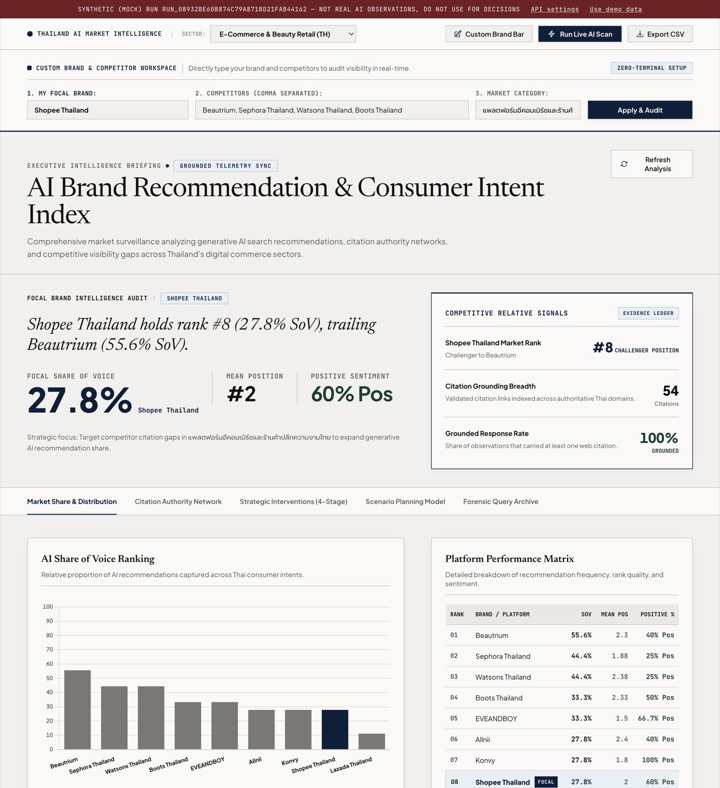

<div align="center">

  <h1>Thailand AI Market &amp; Decision Intelligence</h1>
  <p><b>Measure how generative AI answers recommend brands to Thai consumers — and turn it into a decision.</b></p>

  <sub>AI Share of Voice · Generative Engine Optimization · Citation authority · Multi-surface observation</sub>

  <br/><br/>

  &nbsp;
  &nbsp;
  &nbsp;
  &nbsp;
  

</div>

---

## Overview

When a Thai consumer asks an AI assistant *"ซื้อ / ใช้บริการที่ไหนดี"*, the answer names some brands and not others. This tool measures that: for a fixed set of consumer-intent queries it records which brands each engine recommends, at what rank, with what sentiment, and which web sources the answer leaned on. Results are stored in a DuckDB star schema and summarised into a four-part memo — *what is happening, why, so what, now what* — per market vertical.

It supports several observation engines and keeps their signals separate, because a generative recommendation and a Google search-result position are not the same measurement.

<div align="center">
  
  <br/>
  <sub>Every view is labelled with its data mode: <b>LIVE</b>, <b>SYNTHETIC (MOCK)</b>, <b>NO DATA</b>, or <b>ERROR</b>.</sub>
</div>

---

##  Features

- **Query universe generator** — six consumer-intent pillars × Thai personas, seeded and reproducible.
- **Five observation engines** — `mock` (synthetic), `gemini`, `openrouter`, `serper`, `tavily`. Each observation records its provider, answer surface, model, prompt version, and parse status.
- **Answer-surface separation** — Share of Voice and Net Recommendation Score are reported per surface; the headline figure uses generative answers only.
- **DuckDB star schema** — `dim_brand`, `dim_query`, `fact_observation`, `fact_brand_mention`, `fact_citation`, all tagged with a `run_id`. Analytics read back from the database, not an in-memory list.
- **Decision memo** — competitor gap analysis in a *What → Why → So what → Now what* structure.
- **Web dashboard + REST API** — background scans with live progress, CSV/JSON export, and an honest data-mode banner on every view.
- **Live OpenRouter free-model discovery** — the free tier changes constantly, so the model list is fetched and probe-checked on demand.
- **Bring-your-own-key** — pass a provider key per request via `X-Provider-Key`; it is used to build the engine and then discarded, never logged or persisted.

---

##  Installation

Requires Python 3.11+.

```bash
git clone https://github.com/adulsaa-q/ai_brand_tracker
cd ai_brand_tracker

pip install -e ".[dev]"            # core + test tooling
pip install -e ".[dev,dashboard]"  # also the Streamlit view

cp .env.example .env               # add API keys (all optional — see Configuration)
```

---

##  Usage

```bash
# synthetic run — deterministic, no network, clearly labelled
python -m src.cli run --vertical ev_automotive_th --count 30 --engine mock

# real runs
python -m src.cli models                                        # live OpenRouter free models
python -m src.cli run --vertical ecommerce_retail_th --engine serper --count 15
python -m src.cli run --vertical ecommerce_retail_th --engine gemini --count 15

# server + web dashboard on http://localhost:8000
python -m src.cli serve --port 8000
```

| Engine | Answer surface | Typical speed | Free tier |
| :--- | :--- | :--- | :--- |
| `mock` | synthetic | instant | n/a — never a decision input |
| `serper` | organic SERP position | ~2 s/query | 2,500 queries |
| `tavily` | web retrieval / citations | ~5 s/query | 1,000 credits/month |
| `gemini` | generative answer (search-grounded) | ~25 s/query | ~250 requests/day |
| `openrouter` | generative answer | ~30–60 s/query | free models, rate-limited |

> Generative engines are slow. Run large scans as a scheduled job, or keep `--count` low.

---

##  Configuration

All configuration is environment variables (see `.env.example`). Nothing is required to run a `mock` scan.

| Variable | Purpose |
| :--- | :--- |
| `GEMINI_API_KEY`, `OPENROUTER_API_KEY`, `SERPER_API_KEY`, `TAVILY_API_KEY` | Engine keys. Only the engine you run needs one. |
| `AIBT_API_KEYS` | Comma-separated API keys. Unset → open mode (writes allowed, logged). Set → writes require `X-API-Key` or `Authorization: Bearer`. |
| `AIBT_REQUIRE_AUTH` | `true` also gates read endpoints. |
| `AIBT_ALLOWED_ORIGINS` | Comma-separated CORS origins. Unset → `*` with a warning. |
| `AIBT_MAX_CONCURRENT_SCANS`, `AIBT_MAX_RUNS_PER_DAY` | Scan abuse limits (default 2 / 200). |
| `DATA_DIR`, `ENTITIES_PATH` | Output directory and vertical config path. |

Security posture, including how untrusted provider/web content is handled, is documented in [SECURITY.md](SECURITY.md).

---

##  API

| Method | Endpoint | Description |
| :--- | :--- | :--- |
| `GET` | `/api/v1/health` | Liveness plus dependency checks and auth mode |
| `GET` | `/api/v1/verticals` | List market sectors |
| `GET` | `/api/v1/models` | Live OpenRouter free-model list |
| `POST` | `/api/v1/verticals` | Create or replace a custom sector *(write)* |
| `POST` | `/api/v1/scan` | Queue a background scan; `X-Provider-Key` for BYOK *(write)* |
| `GET` | `/api/v1/scan/{id}/progress` | Progress and run statistics |
| `GET` | `/api/v1/metrics/{vertical}` | Latest run summary |
| `GET` | `/api/v1/export/{vertical}` | CSV or JSON export |

---

##  Architecture

The full diagram set — system map, scan sequence, star-schema ERD, surface taxonomy, and the bring-your-own-key flow — is in [docs/ARCHITECTURE.md](docs/ARCHITECTURE.md). Design decisions are recorded as ADRs in [docs/adr/](docs/adr/). See [docs/README.md](docs/README.md) for the full documentation index.


```mermaid
flowchart LR
    CLI["CLI / Web"] --> API["FastAPI<br/>auth + scan limiter"]
    API --> RUN["run_intelligence_pipeline<br/>run_id"]
    RUN --> GEN["QueryUniverseGenerator"] --> ENG["EngineFactory"]
    ENG --> E["mock · gemini · openrouter<br/>serper · tavily"]
    E --> OBS["RawObservation<br/>provider · answer_surface · parse_status"]
    OBS --> DUCK[("DuckDB star schema")]
    DUCK --> REPO["AnalyticsRepository<br/>load_observations(run_id)"]
    REPO --> AN["SoV / NRS per surface<br/>4-stage memo · citation graph"]
    AN --> OUT["atomic JSON summaries"]
    OUT --> API
    OUT --> WEB["Web dashboard"]
```

```
config/            entities.yaml · control_benchmark_set.yaml · thai_personas.yaml
src/
  runner.py        pipeline: generate → observe → persist → reload → analyse
  api.py           REST + static mount        security.py   auth + scan limiter
  prompts.py       versioned prompt registry  brands.py     canonical brand identity
  universe/        query generator + Thai temporal calendar
  engines/         mock · gemini · openrouter · serper · tavily  (+ _http, _parsing)
  storage/         duckdb_store.py            (SQLite dropped — ADR 0001)
  analytics/       metrics · opportunity · citation_graph · claim_intelligence · repository
docs/              ARCHITECTURE.md · STATUS.md · adr/
```

---

##  Development

```bash
pytest tests/ -q                       # unit, contract, integration, acceptance
ruff check . && ruff format --check .
python -m build --wheel                 # packaging check
```

CI runs an editable install, wheel build, import smoke test, linting, and the full
suite on every push. The integration test asserts that generated queries, persisted
observations, mention and citation rows, and analytics input all reconcile; the
acceptance test walks the whole scenario end to end and checks that a failed engine
is never reported as a successful result.

Current per-feature status — what is shipped, experimental, demo-only, or planned —
is tracked in [docs/STATUS.md](docs/STATUS.md).

---

## Acknowledgements

Built with AI assistance (Claude Code). Direction, architecture decisions,
review, and testing are the author's; pair-written commits carry a
`Co-Authored-By` trailer.

## License

MIT — see [LICENSE](LICENSE). Built by Adul Sa-a (Q).
