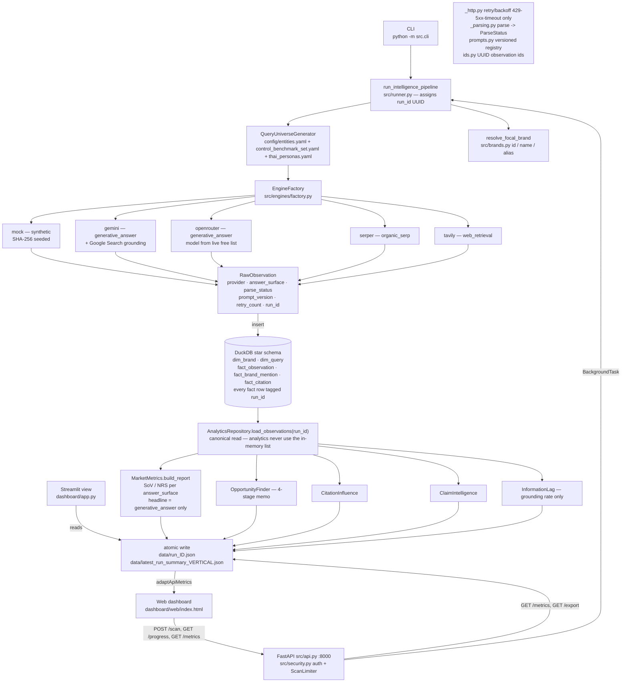
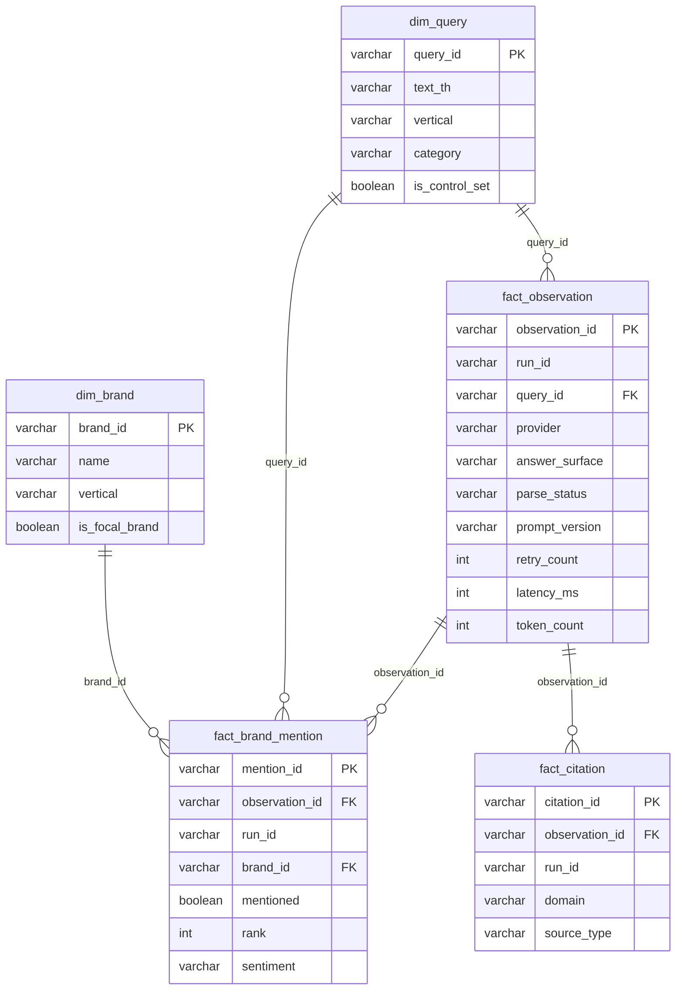
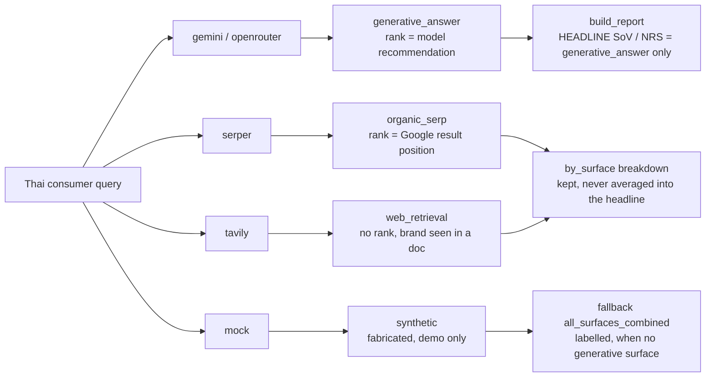
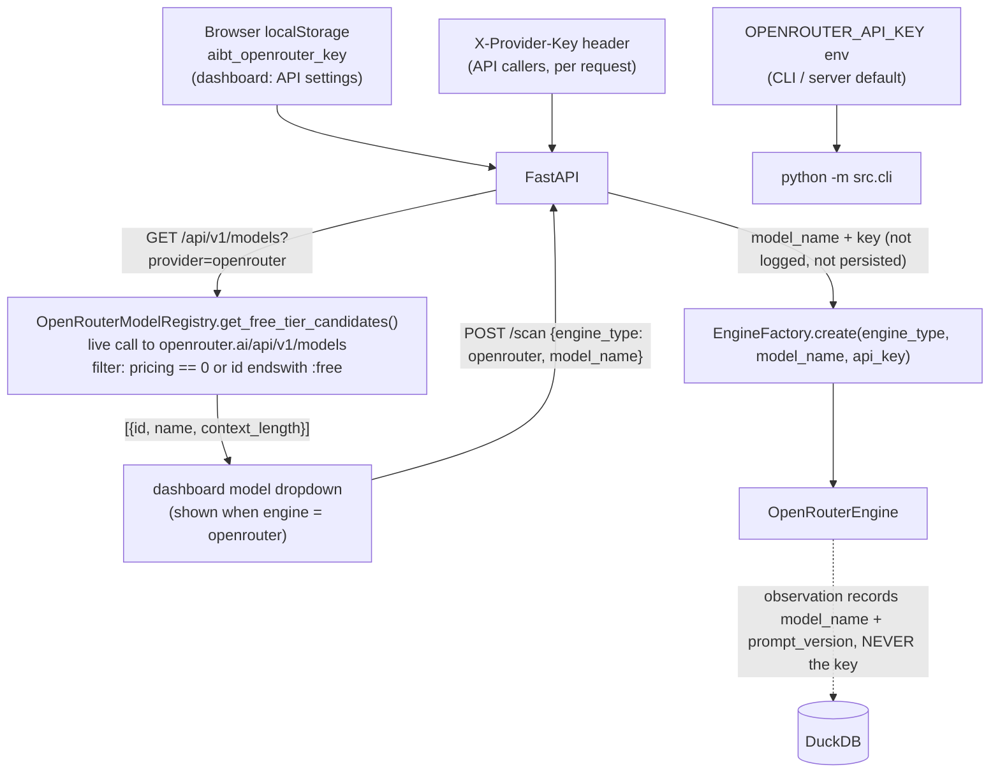
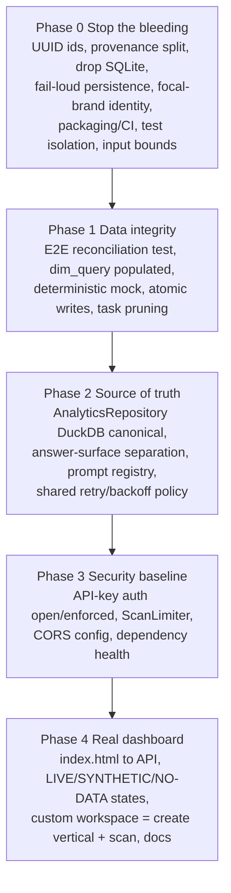

# Architecture & project flow

Diagrams render on GitHub. The code is the source of truth; if a diagram
disagrees, the code wins.

- Storage decision: [ADR 0001](adr/0001-single-analytical-store.md)
- Answer surfaces & temporal context: [ADR 0002](adr/0002-engine-surfaces-and-temporal-context.md)
- Per-feature status: [STATUS.md](STATUS.md)
- Security posture: [../SECURITY.md](../SECURITY.md)

---

## 1. System map



---

## 2. Scan runtime sequence (web dashboard to live data)

```mermaid
sequenceDiagram
    autonumber
    actor U as Analyst
    participant W as index.html
    participant A as FastAPI
    participant L as ScanLimiter
    participant P as pipeline
    participant D as DuckDB

    U->>W: pick vertical + engine + model, click Run Scan
    W->>A: POST /api/v1/scan (X-API-Key, X-Provider-Key, model_name)
    A->>A: validate count 1..200, engine, vertical exists else 404
    A->>L: acquire — 429 if concurrency or daily quota exceeded
    A-->>W: 200 task_id, data_mode
    A->>P: queue background task

    loop every ~900ms until COMPLETED or FAILED
        W->>A: GET /api/v1/scan/{task_id}/progress
        A-->>W: status, progress_pct, completed/total, run_stats
    end

    P->>D: generate queries, persist dim_query
    loop each query
        P->>P: engine.observe — EngineError increments provider_errors
        P->>D: insert_observation — failure increments persistence_failures
    end
    P->>P: if 0 persisted then raise (task FAILED, no fabricated insight)
    P->>D: AnalyticsRepository.load_observations(run_id)
    P->>P: build_report, opportunities, citations, claims, lag
    P->>P: atomic write summary files
    P->>L: release

    W->>A: GET /api/v1/metrics/{vertical}
    A-->>W: full run summary
    W->>W: adaptApiMetrics then renderAll; banner LIVE / SYNTHETIC / ERROR
```

---

## 3. Data model (star schema)



---

## 4. Answer-surface taxonomy (why metrics do not mix engines)



---

## 5. Bring-your-own-key and the live free-model list (OpenRouter)

OpenRouter's free tier changes constantly, so the model list is fetched live, not
hardcoded. API keys are never stored server-side — they travel per request and
are dropped after use.



---

## 6. Remediation phase map (branch phase/0-4-remediation)


